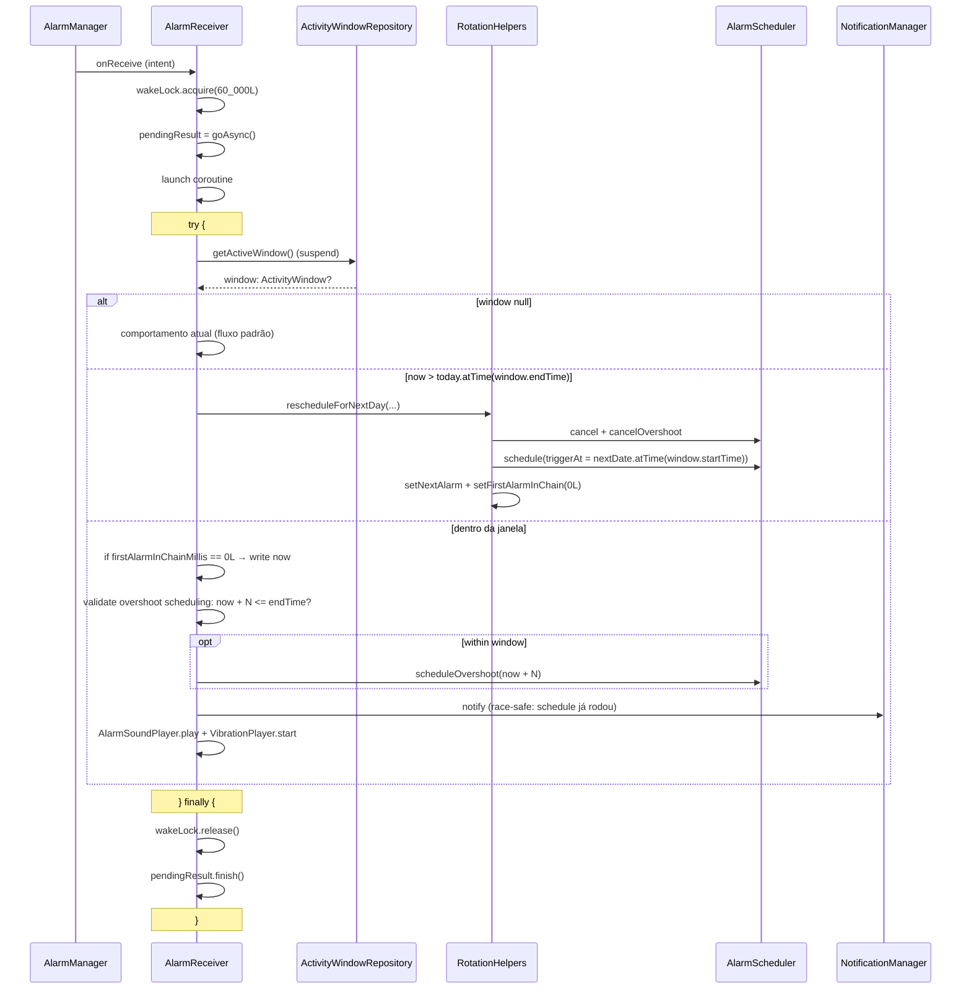

# feat: Alarm snooze, vibration, overshoot bound, skip removal, picker stability

## Summary

Cinco mudanças num só PR derivadas de uso real do app GtG: (1) `SessionPreferences` ganha `firstAlarmInChainMillis` como anchor-class para rastrear o primeiro disparo da cadeia; `HomeScreen` substitui o timer regressivo por um contador crescente `+MM:SS` enquanto `chainStartedAtMillis != null` e libera Check a qualquer momento dentro da `ActivityWindow`. (2) `VibrationPlayer.start` passa a aceitar `bypassDnd` e construir `AudioAttributes` com `USAGE_ALARM`/`USAGE_NOTIFICATION`, espelhando o que `AlarmSoundPlayer` já faz. (3) `AlarmReceiver` migra para `goAsync()` + `try/finally`, consulta `ActivityWindowRepository.getActiveWindow()` antes de tocar e empurra a cadeia para a próxima janela ativa via um helper `rescheduleForNextDay` extraído como top-level `suspend fun` em `RotationHelpers.kt`. (4) Botão "Pular" sai por completo da `AlarmActivity`. (5) `WheelNumberPicker` corrige o cálculo de centro e o snap em fling rápido. Os 10 deferred items da review pass do brainstorm entram como decisões resolvidas, não como follow-ups.

---

## Problem Frame

Cinco atritos independentes do uso real, descritos por extenso no origin (Problem Frame): snooze esconde quanto atraso acumulou e bloqueia Check em snoozes longos; vibração silenciada por `USAGE` indefinido em DND/OEMs; overshoot infinito fora da janela quando ninguém atende e o app está fechado; botão "Pular" desbalanceia rotação sem trazer capacidade que Snooze já não cubra; `WheelNumberPicker` pula hora em fling rápido por cálculo de centro baseado em proximidade visual. (Ver origin para o detalhamento de cada um.)

---

## Requirements

- R1. `SessionPreferences` ganha `firstAlarmInChainMillis: Long` (default `0L`) como anchor-class — set apenas no primeiro disparo da cadeia em `AlarmReceiver`, secondary writers (snooze, overshoot, `rescheduleFromAnchor`) NÃO sobrescrevem. (origin R1, R2)
- R2. Reset de `firstAlarmInChainMillis` em: `HomeViewModel.performManualCheck`, `AlarmViewModel.performCheck`, `HomeViewModel.stopSession`, todos os caminhos do helper `rescheduleForNextDay` (HomeVM rollover + AlarmReceiver out-of-window), `SessionPreferences.clearSession` e — defensivamente — `BootReceiver` no reagendamento (cura ghost-chain após force-stop/reboot/update). (origin R3 + Deferred items 4-5)
- R3. `HomeUiState` ganha `chainStartedAtMillis: Long?` e `chainElapsedSeconds: Long`. Quando `chainStartedAtMillis != null` E `isSessionActive`, `HomeScreen` exibe contador crescente `+MM:SS` (ou `+HH:MM:SS` se > 1h) em vez do timer regressivo, calculado pelo mesmo `countdownJob`. (origin R4, R5)
- R4. `canCheck` ignora `CHECK_WINDOW_SECONDS` (5min) quando `chainStartedAtMillis != null` E o instante atual está dentro da `ActivityWindow` em dia ativo. Antes do primeiro disparo da cadeia, mantém regra atual (`remaining ≤ CHECK_WINDOW_SECONDS` ou `isOverdue`). (origin R6, R7)
- R5. Label acima do contador muda de "PRÓXIMO EXERCÍCIO"/"QUASE LÁ"/"HORA DO GTG" para uma nova string "ADIADO" durante cadeia, em `GtgPrimary` 16sp letterSpacing 2sp. Cor do card e accent permanecem normais (sem overdue red pulse). Secondary "atrasado" text suprimido durante cadeia. (origin R8 + Deferred Counter visual)
- R6. `RoutinePreviewCard` é escondido enquanto `chainStartedAtMillis != null`. (Deferred RoutinePreviewCard)
- R7. Botão "Silenciar" preservado — cobre o caso "som tocando agora, só quero parar sem Check". (origin R9)
- R8. `VibrationPlayer.start(context, bypassDnd: Boolean)` constrói `AudioAttributes` com `setContentType(CONTENT_TYPE_SONIFICATION)` + `setUsage(if (bypassDnd) USAGE_ALARM else USAGE_NOTIFICATION)` e chama o overload `vibrate(VibrationEffect, AudioAttributes)`. `AlarmReceiver` passa `sessionPrefs.bypassDnd`. Sem configuração nova em Settings. (origin R10, R11, R12, R13)
- R9. Remoção total do "Pular": `TextButton` em `AlarmActivity.AlarmScreen`, parâmetro `onSkip`, método `AlarmViewModel.performSkip`, string `R.string.alarm_skip` em `values/strings.xml` e `values-pt-rBR/strings.xml`. Spacing entre Check e Snooze preservado (12dp). (origin R15, R16, R17, R18)
- R10. `rescheduleForNextDay` extraído como top-level `suspend fun` em `app/src/main/java/com/gtg/app/domain/usecase/RotationHelpers.kt`, recebendo `AlarmScheduler`, `SessionPreferences`, `ActivityWindow`, `activeDays: Set<DayOfWeek>`, `pendingExerciseId/Name/TargetReps` como parâmetros. `HomeViewModel.rescheduleForNextDayKeepingExercise` delega; `AlarmReceiver` chama no caminho out-of-window. NÃO vira `UseCase` nomeado — espelha `findNextActiveDate`/`pickNextExerciseInRotation`. (origin R19 + Deferred RescheduleForNextDayUseCase)
- R11. `AlarmReceiver.onReceive` migra para `goAsync()`. Toda a lógica suspend (incluindo `getActiveWindow`, schedule de próximo overshoot, e a chamada a `rescheduleForNextDay` quando aplicável) roda dentro de `try { ... } finally { wakeLock.release(); pendingResult.finish() }`. `wakeLock.acquire(60_000L)` (era 30s). (origin R20, R24)
- R12. Decisão de tocar/empurrar:
  - Se `activeWindow == null`: comportamento atual (toca).
  - Se `activeWindow != null` E o instante atual (`LocalDateTime.now()` na zona local) ultrapassou `today.atTime(window.endTime)` (comparação cronológica completa, não `LocalTime` cega): NÃO toca som/vibração/notificação, NÃO agenda próximo overshoot, chama `rescheduleForNextDay`.
  - Caso contrário: comportamento atual (toca). O overshoot pode tocar exatamente em `endTime`. (origin R20, R21, R22 + Deferred DST/cross-midnight)
- R13. Agendamento do próximo overshoot dentro do `AlarmReceiver` valida que `LocalDateTime.now().plusMinutes(overshootRepeatMinutes)` não ultrapassa `today.atTime(window.endTime)` no mesmo dia ativo. Se passaria, NÃO agenda — a cadeia para sozinha; rollover já foi disparado se chegou aqui. (origin R22)
- R14. Race invariant preservado: `scheduleOvershoot` (ou skip-schedule no caminho out-of-window) executa ANTES de `NotificationManagerCompat.notify`, ANTES de `AlarmSoundPlayer.play`, ANTES de `VibrationPlayer.start`. (origin R20 + learning `alarm-receiver-overshoot-schedule-race`)
- R15. Guard de dia inativo em `AlarmReceiver.kt:76` (`isOvershoot && dayOfWeek !in activeDaysOfWeek`) permanece — defesa em profundidade contra paths não cobertos por R12. (origin R23)
- R16. `AlarmReceiver` injeta `ActivityWindowRepository` via Hilt (`@AndroidEntryPoint` + `@Inject lateinit var`), espelhando o padrão de `AlarmViewModel`. (origin R24)
- R17. `WheelNumberPicker.centeredIndex` substitui o cálculo `items.minBy { ... }.index` por `state.firstVisibleItemIndex + (visibleItems / 2)`, coerced para `0..max`. O `LaunchedEffect` que monitora `isScrollInProgress` chama `state.scrollToItem(centeredIndex)` (instantâneo) ao detectar fim de fling, garantindo snap pixel-perfect. `LaunchedEffect(value)` mantém `state.scrollToItem(v)` — **diverge intencionalmente de origin R27**, que prescrevia `animateScrollToItem(v)`; OQ2 foi resolvida para `scrollToItem` (instantâneo) por evitar delay de animação antes de `onValueChange`. (origin R25, R26, R28, R29 + OQ2 resolvendo R27)
- R18. Strings novas e atualizadas em `strings.xml` pt-BR e en. Sem hardcode em Composables. (origin R30)
- R19. Sem migração de schema Room — `firstAlarmInChainMillis` é additive em SharedPreferences, default `0L` seguro para installs antigos. (origin R31)

**Origin acceptance examples preservados:** AE1, AE2, AE3 (Item 1); AE4, AE5 (Item 2); AE6 (Item 3); AE7, AE8 (Item 4); AE9, AE10 (Item 5). Cada um vira test scenario na unit correspondente, marcado com `Covers AE<N>.`.

---

## Scope Boundaries

- **N1. Sem configuração de pattern/intensidade de vibração** em Settings (origin N1) — caminho mínimo de fix.
- **N2. Sem migração para `VibrationAttributes` (API 33+)** — `AudioAttributes` cobre `minSdk 26..36` sem branching; reavaliar quando `minSdk` subir (origin N2).
- **N3. Sem log de "missed sets" / "skip with reps=0"** — Skip sai do produto; alternativa rejeitada na decisão sobre Item 3 (origin N3).
- **N4. Snooze NÃO avança rotação** — comportamento atual estava correto, permanece (origin N4).
- **N5. Sem rebuild do `WheelNumberPicker`** — substituir por widget novo (Material 3 Picker, Canvas custom) está fora; o lote só estabiliza o cálculo de centro e snap (origin N5).
- **N6. Sem cobertura de teste para `AlarmReceiver.onReceive` em isolamento** — sem Robolectric/instrumentation infra (`libs.versions.toml` não declara nenhum). Cobertura virá indireta: `rescheduleForNextDay` (helper extraído) é unit-testável via MockK; o resto é verificado manualmente em dispositivo. (Ver Risks.)

### Deferred to Follow-Up Work

- **Refresh de `docs/solutions/` após o lote**: capture-worthy via `/ce-compound` para os 3 gaps identificados pelo learnings-researcher (Vibrator AudioAttributes + OEM quirks, DST/timezone handling em alarm scheduling, LazyListState snap fling pixel-perfect snap). Será o primeiro learning em cada subdiretório respectivo.

---

## Context & Research

### Relevant Code and Patterns

- `app/src/main/java/com/gtg/app/domain/usecase/RotationHelpers.kt` — precedent estabelecido para top-level helper functions (`findNextActiveDate`, `pickNextExerciseInRotation`). Confirmação direta de que `rescheduleForNextDay` deve seguir esse shape e não virar `UseCase`.
- `app/src/main/java/com/gtg/app/presentation/alarm/AlarmSoundPlayer.kt:62-77` — template do `AudioAttributes.Builder` que `VibrationPlayer` vai espelhar (`CONTENT_TYPE_SONIFICATION` + `USAGE_ALARM`/`USAGE_NOTIFICATION` conditional em `bypassDnd`).
- `app/src/main/java/com/gtg/app/presentation/alarm/AlarmViewModel.kt:150-204` — `performSnooze` + `clampSnoozeToBounds` são o template do AlarmReceiver out-of-window guard. `rescheduleForNextDay` deve consumir as mesmas convenções (`findNextActiveDate`, `window.startTime` como fallback).
- `app/src/main/java/com/gtg/app/presentation/home/HomeViewModel.kt:485-516` — `rescheduleForNextDayKeepingExercise` é a fonte da extração; após U2, delega ao helper.
- `app/src/main/java/com/gtg/app/presentation/home/HomeViewModel.kt:215-287` — `observeSessionPreferences` consome o `Flow<Long>` de `SessionPreferences.observeChanges()`; novo campo `firstAlarmInChainMillis` precisa ser adicionado ao `PrefsSnapshot` data class para que mudanças disparem `restartCountdown`.
- `app/src/main/java/com/gtg/app/presentation/home/HomeViewModel.kt:430-474` — `restartCountdown` é onde o cálculo de `remaining` e `canCheck` mora; precisa de uma branch para chain mode.
- `app/src/main/java/com/gtg/app/presentation/home/HomeScreen.kt:607-828` — `CountdownContent` renderiza a card de countdown; a transição entre overdue red e chain blue calm acontece aqui (`isOverdue` continua disponível mas o tratamento visual ramifica em `chainStartedAtMillis`).
- `app/src/main/java/com/gtg/app/presentation/common/WheelNumberPicker.kt:64-95` — código atual de `centeredIndex` e `LaunchedEffect(value)` a substituir.
- `app/src/main/AndroidManifest.xml:25` — `android.permission.VIBRATE` já declarada; nenhuma mudança no manifesto.

### Institutional Learnings

- `docs/solutions/logic-errors/alarm-receiver-overshoot-schedule-race-2026-05-19.md` — race invariant: `scheduleOvershoot` (ou no nosso caso, skip-schedule no out-of-window) DEVE rodar antes de `NotificationManagerCompat.notify`. R14 codifica isso explicitamente; teste manual deve confirmar.
- `docs/solutions/logic-errors/active-days-alarm-bypass-2026-05-16.md` — "correction belongs at the schedule site, not at fire time" e enumeração de writers do `AlarmManager`. R13 (validar `now + overshootRepeatMinutes ≤ endTime` no agendamento do próximo overshoot) segue esse princípio. R12 (out-of-window guard ao FIRE) é defesa em profundidade adicional para casos onde o agendamento legacy escapou da correção.
- `docs/solutions/architecture-patterns/cadence-anchor-vs-reschedule-anchor-2026-05-19.md` — anchor-class fields (escritos apenas no originating action, secondary writers preservam). `firstAlarmInChainMillis` aplica essa disciplina: `rescheduleFromAnchor` NÃO reseta porque o evento mental do usuário (cadeia ativa) não terminou — só o intervalo mudou. R2 codifica os writers permitidos.

### External References

- Não consultadas — stack interno (Kotlin/Compose/Hilt/Room/AlarmManager/Vibrator) já bem coberto pelos precedents acima.

---

## Key Technical Decisions

- **`rescheduleForNextDay` extraído como top-level `suspend fun` em `RotationHelpers.kt`, NÃO como `UseCase`**: precedent direto (`findNextActiveDate`, `pickNextExerciseInRotation`) + finding de scope-guardian sobre abstração com 1 consumidor + cadence-anchor learning prefere helpers explícitos com deps passadas como params. Mata OQ1 do origin (localização do pacote).
- **`firstAlarmInChainMillis` classificado como anchor-class (chain history)**: set apenas no primeiro disparo (R1), secondary writers preservam. Aplicação direta do `docs/solutions/architecture-patterns/cadence-anchor-vs-reschedule-anchor-2026-05-19.md`. Implicação: `rescheduleFromAnchor` (mudança de intervalo mid-cadeia) NÃO reseta — counter continua tempo desde primeiro alarme original. Confirma o argumento do learning sobre "evento mental do usuário".
- **Counter visual durante cadeia substitui overdue red pulse por chain blue calm**: card normal sem pulse, label "ADIADO" em `GtgPrimary` 16sp 2sp letterSpacing, contador em `GtgPrimary`, secondary "atrasado" text suprimido. Razão: cadeia comunica "snoozed/waiting", não "overdue urgency"; acumular pulse + counter dilui sinal. Mantém apenas o pulse 1.04f do botão Check se overdue ainda for verdadeiro semanticamente, mas no caminho típico (snooze imediato) Check vira azul calmo.
- **`RoutinePreviewCard` escondido durante cadeia**: chain state consome o foco; preview do resto do dia gera ruído quando o usuário precisa decidir entre Check ou continuar adiando. Card volta a aparecer após Check/Stop/rollover.
- **DST/cross-midnight/timezone: comparação cronológica completa, não `LocalTime` cega**: `LocalDateTime.now()` na zona local vs `today.atTime(window.endTime)` (mesmo dia). Trata cross-midnight corretamente (now em 00:03 com endTime 23:55 dia anterior dá now > endTime no dia atual). DST spring-forward: o instante físico do alarme dispara conforme `setAlarmClock`, então a comparação em local time reflete a janela esperada pelo usuário no relógio de parede — comportamento explicitamente aceito como trade-off.
- **`R26 vs OQ2` resolvido para `scrollToItem` (instantâneo)**: snap point já está calculado em `firstVisibleItemIndex + visibleItems/2`; animar adiciona delay desnecessário antes do `onValueChange`. Verificação manual em dispositivo durante implementação confirma se sente snappy.
- **Ghost-chain recovery via BootReceiver reset defensivo**: simples e load-bearing. Quando o BootReceiver reagenda após reboot/update, zera `firstAlarmInChainMillis` — cadeia mental termina junto com o boot. Alternativa "HomeViewModel detecta ghosted state heuristicamente" foi rejeitada como mais frágil (precisa thresholds arbitrários).
- **Label "ADIADO" mantido** (origin OQ3): direto, curto, não compete com "QUASE LÁ" do overdue legacy. Reavaliar se UX em campo sugerir.
- **Sem testes unitários para `AlarmReceiver.onReceive`**: `libs.versions.toml` não tem Robolectric ou instrumentation. Cobertura indireta via testes do helper `rescheduleForNextDay` (puro com mocks) + verificação manual de cadeia completa em dispositivo.

---

## Open Questions

### Resolved During Planning

- **OQ1 origin (pacote de `RescheduleForNextDayUseCase`)**: resolvido — não vira UseCase. Top-level `suspend fun rescheduleForNextDay(...)` em `RotationHelpers.kt`. (Ver Key Technical Decisions.)
- **OQ2 origin (`animateScrollToItem` vs `scrollToItem`)**: resolvido — `scrollToItem`. (Ver Key Technical Decisions.)
- **OQ3 origin (label "ADIADO" copy)**: resolvido — "ADIADO" mantido. (Ver Key Technical Decisions.)
- **Deferred R6 vs R20/R21 (Check fora da janela)**: resolvido — R6 do origin é defesa em profundidade. Quando R12 (out-of-window) faz rollover, `firstAlarmInChainMillis` já zera (via R2), então `chainStartedAtMillis` vira null e Check segue regra antiga. A cláusula "fora da janela, Check desabilitado" mantém-se como invariante explicitada mas inalcançável no caminho normal.
- **Deferred `rescheduleFromAnchor` reset**: resolvido — NÃO reseta (anchor-class discipline). Counter mostra tempo desde primeiro alarme original mesmo após mudança de baseInterval/activeDays mid-cadeia.
- **Deferred `performSnooze` semantics**: resolvido — snooze NÃO toca `firstAlarmInChainMillis` (não passa por AlarmReceiver de qualquer forma; primary remarcado pelo snooze entra em R2 com `!= 0L`, preserva).
- **Deferred ghost-chain recovery**: resolvido — BootReceiver zera defensivamente. (Ver Key Technical Decisions.)
- **Deferred DST/cross-midnight**: resolvido — comparação cronológica completa via `LocalDateTime` na data correta. (Ver Key Technical Decisions.)
- **Deferred AlarmActivity layout post-Skip**: resolvido — spacing 12dp Check↔Snooze mantido; label do Snooze não muda ("Adiar N min" já claro como "não agora"); back gesture / swipe da notificação documentado em comentário de código mas sem hint visual extra (consistência com convenção do app).
- **Deferred RoutinePreviewCard durante chain**: resolvido — escondido.
- **Deferred Skip removal capability**: resolvido — aceito como trade-off explícito por confirmação direta do usuário no brainstorm ("retira skip").

### Deferred to Implementation

- **Render visual final do counter `+MM:SS`**: o brainstorm e este plano especificam color/sizing por requirements, mas o ajuste fino (kerning, baseline alignment com a card) verifica-se em dispositivo durante U4.
- **Validação manual da race invariant em U3**: o teste de "som não tocou antes de schedule" precisa de bench físico — dispositivo em DND, snooze configurado para 1min, observar que a cadeia não pula gate de notificação.

---

## High-Level Technical Design

> *This illustrates the intended approach and is directional guidance for review, not implementation specification. The implementing agent should treat it as context, not code to reproduce.*

### Chain lifecycle — quando `firstAlarmInChainMillis` muda

```
                    ┌─────────────────────────┐
                    │ Sessão ativa, alarme    │
                    │ agendado mas não tocou  │
                    │ firstAlarmInChainMillis │
                    │      = 0L               │
                    └────────────┬────────────┘
                                 │
                                 │ AlarmReceiver.onReceive
                                 │ firstAlarmInChainMillis == 0L
                                 │ → escreve now (T0)
                                 ▼
                    ┌─────────────────────────┐
        ┌──────────►│ Cadeia ativa            │◄─────────┐
        │           │ chainStartedAtMillis=T0 │          │
        │           │ Home mostra +MM:SS      │          │
        │           │ Check sempre habilitado │          │
        │           │ dentro da janela        │          │
        │           └─────────────────────────┘          │
        │              │       │       │                 │
        │              │       │       │                 │
   AlarmReceiver       │       │       └── AlarmActivity.performSnooze
   re-dispatch         │       │           (preserva T0,
   (overshoot)         │       │           agenda primary novo)
   (preserva T0)       │       │
                       │       │
                       │       │
                       │       └─── HomeViewModel.observeSessionPreferences
                       │            detecta intervalChangedDuringSession
                       │            → rescheduleFromAnchor()
                       │            (preserva T0 — anchor-class)
                       │
                       │  ╔══════════════════════════════════╗
                       │  ║ EVENTOS DE RESET (→ 0L)         ║
                       └─►║ • HomeViewModel.performManualCheck║
                          ║ • AlarmViewModel.performCheck    ║
                          ║ • HomeViewModel.stopSession      ║
                          ║ • rescheduleForNextDay (rollover)║
                          ║ • SessionPreferences.clearSession║
                          ║ • BootReceiver (defensivo)       ║
                          ╚══════════════════════════════════╝
```

### AlarmReceiver.onReceive — fluxo com goAsync e window bound



---

## Implementation Units

### U1. Campo `firstAlarmInChainMillis` em `SessionPreferences`

**Goal:** Adicionar o campo anchor-class persistido (`Long`, default `0L`), seu setter e o reset em `clearSession`. Estabelece a fundação para U3, U4, U5, U6.

**Requirements:** R1 (parte do storage), R2 (reset em clearSession), R19 (additive migration safe).

**Dependencies:** Nenhum.

**Files:**
- Modify: `app/src/main/java/com/gtg/app/data/local/SessionPreferences.kt`
- Test: `app/src/test/java/com/gtg/app/data/local/SessionPreferencesTest.kt` (criar se não existir; se existir, estender)

**Approach:**
- Adicionar constante `KEY_FIRST_ALARM_IN_CHAIN_MILLIS = "first_alarm_in_chain_millis"` na companion object.
- Adicionar property `firstAlarmInChainMillis: Long` (getter via `prefs.getLong(KEY, 0L)`).
- Adicionar setter `setFirstAlarmInChain(epochMillis: Long)` espelhando `setLastCheck`.
- Em `clearSession()`, adicionar `.putLong(KEY_FIRST_ALARM_IN_CHAIN_MILLIS, 0L)` ao bloco existente.
- KDoc documenta anchor-class discipline: "Set apenas no primeiro disparo de uma cadeia (`AlarmReceiver`). Secondary writers (snooze, overshoot, rescheduleFromAnchor) NÃO sobrescrevem. Reset via `setFirstAlarmInChain(0L)` em Check, Stop, rollover, clearSession, ou BootReceiver no reagendamento."

**Patterns to follow:**
- `KEY_LAST_CHECK_MILLIS` + `lastCheckMillis` property + `setLastCheck(epochMillis)` setter no mesmo arquivo (linhas 61, 186-187, 304-306).

**Test scenarios:**
- Happy path: `firstAlarmInChainMillis` default é `0L` em SharedPreferences vazio.
- Happy path: `setFirstAlarmInChain(1700000000000L)` seguido de leitura retorna `1700000000000L`.
- Edge case: `setFirstAlarmInChain(0L)` (reset explícito) zera o valor.
- Happy path: `clearSession()` zera `firstAlarmInChainMillis` mesmo após `setFirstAlarmInChain(non-zero)`.

**Verification:**
- Build limpo.
- Testes acima passam.
- Install antigo (sem o key) lê `0L` corretamente — verificado via teste com `prefs` mockado sem o key.

---

### U2. Top-level `suspend fun rescheduleForNextDay` em `RotationHelpers`

**Goal:** Extrair a lógica de `HomeViewModel.rescheduleForNextDayKeepingExercise` para um helper compartilhado entre `HomeViewModel` e `AlarmReceiver` (U3), preservando comportamento atual + adicionando reset de `firstAlarmInChainMillis`.

**Requirements:** R10, R2 (reset path).

**Dependencies:** U1 (precisa do setter `setFirstAlarmInChain`).

**Files:**
- Modify: `app/src/main/java/com/gtg/app/domain/usecase/RotationHelpers.kt`
- Modify: `app/src/main/java/com/gtg/app/presentation/home/HomeViewModel.kt` (linhas 485-516 — delegar)
- Test: `app/src/test/java/com/gtg/app/domain/usecase/RotationHelpersTest.kt` (criar/estender)

**Approach:**
- Adicionar `suspend fun rescheduleForNextDay(alarmScheduler: AlarmScheduler, sessionPrefs: SessionPreferences, window: ActivityWindow, activeDays: Set<DayOfWeek>, pendingExerciseId: Long, pendingExerciseName: String, pendingTargetReps: Int)` ao arquivo.
- Conteúdo: calcula `nextDate` via `findNextActiveDate(LocalDate.now(), activeDays)`, computa `nextDateTime = nextDate.atTime(window.startTime)`, computa `nextMillis`, chama `alarmScheduler.cancel()` + `alarmScheduler.cancelOvershoot()` + `alarmScheduler.schedule(triggerAt = nextDateTime, exerciseId = pendingExerciseId, exerciseName = pendingExerciseName, targetReps = pendingTargetReps)`, depois `sessionPrefs.setNextAlarm(epochMillis = nextMillis, exerciseId = pendingExerciseId, exerciseName = pendingExerciseName, targetReps = pendingTargetReps)` e `sessionPrefs.setFirstAlarmInChain(0L)` (reset cadeia).
- `HomeViewModel.rescheduleForNextDayKeepingExercise(window)` passa a delegar: lê `pendingExerciseId/Name/TargetReps` de `sessionPrefs`, lê `activeDaysOfWeek`, e dispara o helper dentro de `viewModelScope.launch` (já está em coroutine — converter para suspend interna se necessário). Depois faz `dismissActiveAlarm()` antes do helper para preservar ordem atual (`cancelOvershoot` + parar som).

**Execution note:** Refator behaviorally-neutral — teste de regressão de `HomeViewModel.rescheduleForNextDayKeepingExercise` ANTES de mover lógica (characterization), depois move e roda os mesmos testes.

**Patterns to follow:**
- `findNextActiveDate` e `pickNextExerciseInRotation` na mesma `RotationHelpers.kt` (linhas 19-52) — top-level functions com deps passadas como params.
- Ordem `schedule → setNextAlarm` (side effect antes de persistência) — convenção do `AlarmSchedulerImpl` documentada no `active-days-alarm-bypass` learning.

**Test scenarios:**
- Happy path: chama o helper com `activeDays = todos os dias`, `window = 08:00-18:00`, today = quarta. Mocks de `AlarmScheduler` e `SessionPreferences` verificam que `schedule` foi chamado com `nextDate = quinta`, `time = 08:00`, e `setNextAlarm` foi chamado com millis correto e `setFirstAlarmInChain(0L)` foi chamado.
- Edge case: `activeDays = apenas seg-sex`, today = sexta. Helper agenda para segunda 08:00 (pulando sáb/dom via `findNextActiveDate`).
- Edge case: `activeDays = {monday}`, today = monday. Helper agenda para próxima segunda (avança 7 dias).
- Integration (covers AE7): chamado com window 08:00-17:30, today = sexta, helper agenda primary para segunda 08:00 e zera `firstAlarmInChainMillis`.
- Happy path (regression): após delegação, `HomeViewModel.rescheduleForNextDayKeepingExercise(window)` continua chamando `dismissActiveAlarm` antes do helper e o estado final do `SessionPreferences` é equivalente ao comportamento pré-refator.

**Verification:**
- Build limpo.
- Testes acima passam.
- Diff de `HomeViewModel.kt` mostra apenas substituição da lógica inline pela chamada ao helper + `dismissActiveAlarm` preservado.

---

### U3. `AlarmReceiver` migrado para `goAsync()` + window bound + chain timestamp + race-safe ordering

**Goal:** Tocar o overshoot somente dentro da janela; chamar `rescheduleForNextDay` no caminho out-of-window; escrever `firstAlarmInChainMillis` no primeiro disparo; preservar a race invariant; tudo dentro de `try/finally` que libera wakeLock e `pendingResult.finish()` em todos os branches incluindo exceções.

**Requirements:** R11, R12, R13, R14, R15, R16. Cobre origin R20, R21, R22, R23, R24 e os Deferred items "DST/cross-midnight" e "goAsync finish() em só 1 branch".

**Dependencies:** U1 (`firstAlarmInChainMillis` field), U2 (`rescheduleForNextDay` helper).

**Files:**
- Modify: `app/src/main/java/com/gtg/app/presentation/alarm/AlarmReceiver.kt`
- Test: cobertura indireta via U2 tests. Verificação manual em dispositivo (ver Non-goal N6).

**Approach:**
- Injetar `ActivityWindowRepository` via `@Inject lateinit var activityWindowRepository: ActivityWindowRepository`.
- Estender `wakeLock.acquire(...)` para `60_000L` (era `30_000L`).
- Estrutura `onReceive`:
  1. Acquire wakeLock.
  2. `val pendingResult = goAsync()`.
  3. `CoroutineScope(SupervisorJob() + Dispatchers.Main).launch { try { ... } finally { wakeLock.release(); pendingResult.finish() } }`.
  4. Dentro do try:
     - Parse intent extras (como hoje).
     - `if (isOvershoot && now.dayOfWeek !in sessionPrefs.activeDaysOfWeek) return` (R15 — guard de dia inativo permanece).
     - `val window = activityWindowRepository.getActiveWindow()`.
     - `if (window != null && LocalDateTime.now() > today.atTime(window.endTime))`: chamar `rescheduleForNextDay(...)` passando deps + activeDays + pending exercise info do `sessionPrefs`. Não toca, não agenda overshoot, não notifica. Return do try.
     - Else: comportamento atual modificado:
       - `if (sessionPrefs.firstAlarmInChainMillis == 0L)` → `sessionPrefs.setFirstAlarmInChain(System.currentTimeMillis())`.
       - `sessionPrefs.setAlarmPending(true)`.
       - Validar `now.plusMinutes(overshootRepeatMinutes) <= today.atTime(window.endTime)` (quando window não-null) ANTES de agendar próximo overshoot. Se passaria do limite, skip. R13.
       - `alarmScheduler.scheduleOvershoot(...)` (R14 — antes de notify).
       - `notify(...)`.
       - `AlarmSoundPlayer.play(...)` se `soundEnabled`.
       - `VibrationPlayer.start(context, bypassDnd = sessionPrefs.bypassDnd)` se `vibrationEnabled` (U7 fornece o param).

**Execution note:** Validação manual obrigatória após implementação — bench físico em dispositivo: snooze configurado para 1min, dispositivo em DND, cronometra fluxo (som não toca antes de scheduleOvershoot completar — observável via logs); rollover out-of-window dispara `rescheduleForNextDay` (verificar via `nextAlarmMillis` na prefs depois).

**Patterns to follow:**
- `clampSnoozeToBounds` em `AlarmViewModel.kt:191-204` — mesma forma de comparar contra `window.endTime` e fazer rollover via `findNextActiveDate` + `window.startTime`.
- Hilt `@AndroidEntryPoint` + `@Inject lateinit var` (já presente; só adicionar nova dep).
- Ordem `schedule → notify → I/O` documentada em `docs/solutions/logic-errors/alarm-receiver-overshoot-schedule-race-2026-05-19.md`.

**Test scenarios:**
- (Manual em dispositivo) Covers AE7: window 08:00-17:30, sexta, primary 17:25, sem atender. 17:30 overshoot toca (in-window). Próximo overshoot validation: `17:30 + 5min = 17:35 > 17:30`? Sim → não agenda. Cadeia para. `rescheduleForNextDay` dispara → primary armado para segunda 08:00. `firstAlarmInChainMillis` zerado.
- (Manual em dispositivo) Covers AE8: domingo (dia inativo), 10:00 overshoot armado escapa. R15 guard dispara cedo (`dayOfWeek not in activeDays`), return. Sem fire, sem agendamento, sem rollover (R12 também rejeitaria, mas R15 short-circuit).
- (Manual em dispositivo) Cross-midnight: window 22:00-23:55, primary 23:53 sem atender, 23:58 overshoot toca. Próximo overshoot: `23:58 + 5min = 00:03 do dia seguinte`. Comparação cronológica: `LocalDateTime.now()` (23:58) `.plusMinutes(5)` = `00:03 do dia seguinte`. `today.atTime(window.endTime)` = `today 23:55`. Comparação `00:03 do dia seguinte > today 23:55` → `true` → skip schedule + dispara rollover.
- (Manual em dispositivo) Exception path: simular `getActiveWindow()` lançando RuntimeException (debug-only via repo flag) → catch implícito do try/finally executa, `pendingResult.finish()` chamado, `wakeLock.release()` chamado. Logcat confirma ausência de ANR.

**Verification:**
- Build limpo + compilação Hilt OK.
- Cadeia de overshoot para automaticamente quando passa do `endTime` em testes manuais.
- `firstAlarmInChainMillis` aparece em `getSharedPreferences` dump após primeiro alarme; permanece estável durante overshoots/snoozes; zera após Check.
- Sem ANRs observados em logcat durante reboot/exception paths.

---

### U4. `HomeViewModel` + `HomeScreen` chain UX (counter + chain blue calm + suppressed RoutinePreviewCard)

**Goal:** Plumber o `firstAlarmInChainMillis` até a UI; substituir timer regressivo por counter crescente durante cadeia; aplicar chain blue calm visual; esconder `RoutinePreviewCard`; ajustar `canCheck`; resetar `firstAlarmInChainMillis` em `performManualCheck` e `stopSession`.

**Requirements:** R3, R4, R5, R6, R7, R2 (reset em performManualCheck/stopSession), R18 (novas strings).

**Dependencies:** U1 (field), U3 (timestamp escrito pelo receiver).

**Files:**
- Modify: `app/src/main/java/com/gtg/app/presentation/home/HomeViewModel.kt`
- Modify: `app/src/main/java/com/gtg/app/presentation/home/HomeScreen.kt`
- Modify: `app/src/main/res/values/strings.xml`
- Modify: `app/src/main/res/values-pt-rBR/strings.xml`
- Test: `app/src/test/java/com/gtg/app/presentation/home/HomeViewModelTest.kt` (criar/estender)

**Approach:**

*ViewModel:*
- Adicionar a `HomeUiState`: `chainStartedAtMillis: Long? = null`, `chainElapsedSeconds: Long = 0`.
- Adicionar `firstAlarmInChainMillis` ao `PrefsSnapshot` data class para que diff no `observeSessionPreferences` dispare `restartCountdown` quando o campo muda.
- No collector de `observeSessionPreferences`, atualizar `_state` com `chainStartedAtMillis = sessionPrefs.firstAlarmInChainMillis.takeIf { it > 0L }`.
- No `restartCountdown` loop (linha ~430):
  - Se `chainStartedAtMillis != null`: `chainElapsedSeconds = (nowMillis - chainStartedAtMillis) / 1000`. Continua calculando `remaining` para o roll-over check de fim de janela. `canCheck = true` quando dentro da `ActivityWindow` + dia ativo (extrair helper privado `isInsideActivityWindow(now, window, activeDays)`).
  - Se `chainStartedAtMillis == null`: comportamento atual (regra `remaining ≤ CHECK_WINDOW_SECONDS || isOverdue`).
- Em `performManualCheck`: adicionar `sessionPrefs.setFirstAlarmInChain(0L)` no início (próximo a `setLastCheck(nowMillis)`).
- Em `stopSession`: adicionar `sessionPrefs.setFirstAlarmInChain(0L)` (ou contar com `clearSession` que já zera — confirmar; se redundante, manter chamada explícita pra clareza).

*Screen:*
- `CountdownContent` recebe novos params: `chainStartedAtMillis: Long?`, `chainElapsedSeconds: Long`.
- Quando `chainStartedAtMillis != null`:
  - Label acima muda para `stringResource(R.string.home_chain_label_paused)` ("ADIADO") em `GtgPrimary` 16sp letterSpacing 2sp.
  - Card containerColor = `GtgSurface` (normal, sem overdue red).
  - `pulseScale` = 1f (sem pulse).
  - `accentColor` do counter = `GtgPrimary` (azul).
  - `AutoShrinkText` recebe `formatCounter(chainElapsedSeconds)` ao invés de `formatCountdown(remainingSeconds)` — nova helper que prefixa com `+`.
  - Secondary "atrasado" text NÃO renderiza durante cadeia (omit `if (isOverdue)` block quando `chainStartedAtMillis != null`).
  - Botão Check fica blue normal (sem pulse 1.04f).
- Quando `chainStartedAtMillis == null`: comportamento atual.

*HomeScreen.kt (LazyColumn):*
- `RoutinePreviewCard` só renderiza quando `state.routinePreview.isNotEmpty() && screenState != ScreenState.NO_EXERCISE && state.chainStartedAtMillis == null`.

*formatCounter (helper):*
- `private fun formatCounter(elapsedSeconds: Long): String` — espelha `formatCountdown` mas sempre positivo, sempre prefixado com `+`. Lida com hours/minutes/seconds.

*Strings:*
- `values/strings.xml`: `<string name="home_chain_label_paused">PAUSED</string>` (en).
- `values-pt-rBR/strings.xml`: `<string name="home_chain_label_paused">ADIADO</string>`.

**Patterns to follow:**
- `formatCountdown` no mesmo arquivo `HomeScreen.kt:836-849` para shape de `formatCounter`.
- Convenção de `_state.update { it.copy(...) }`.
- `collectAsStateWithLifecycle()` (já em uso).

**Test scenarios:**
- Covers AE1 (parte ViewModel): `firstAlarmInChainMillis = 14:25 epoch`, `now = 14:28`, `chainElapsedSeconds = 180`, `canCheck = true` (dentro de window 08-18 + dia ativo). `formatCounter(180) = "+03:00"`.
- Covers AE2 (parte ViewModel): após `performManualCheck`, `firstAlarmInChainMillis == 0L`, `chainStartedAtMillis = null`, countdown volta a calcular `remainingSeconds = (nextAlarmMillis - now)/1000` positivo.
- Covers AE3: `chainStartedAtMillis == null`, `remaining = 30*60 = 1800`, `canCheck == false`. Quando `remaining` cai para `200`, `canCheck == true`.
- Edge case: cadeia ativa MAS fora da janela (transient — `firstAlarmInChainMillis > 0` mas `now > windowEnd`): `canCheck == false`. Em prática inalcançável (R12 faz rollover); teste documenta a invariant.
- Happy path: `stopSession` chama `setFirstAlarmInChain(0L)`; state.chainStartedAtMillis vira null.
- Integration: `_state` atualiza corretamente quando `observeSessionPreferences` recebe emit com novo `firstAlarmInChainMillis`.

**Verification:**
- Build limpo.
- Em dispositivo (preview ou device): sequência manual — start session, alarme dispara, snooze, voltar para Home → counter `+MM:SS` cresce, Check habilitado, label "ADIADO" em azul, sem pulse vermelho, sem `RoutinePreviewCard`.
- Após Check: counter some, label volta para "PRÓXIMO EXERCÍCIO", `RoutinePreviewCard` reaparece.

---

### U5. `AlarmViewModel.performCheck` — reset de `firstAlarmInChainMillis`

**Goal:** Garantir que Check via full-screen `AlarmActivity` também encerra a cadeia, mantendo simetria com `HomeViewModel.performManualCheck`.

**Requirements:** R2 (reset em performCheck).

**Dependencies:** U1 (field).

**Files:**
- Modify: `app/src/main/java/com/gtg/app/presentation/alarm/AlarmViewModel.kt` (linha ~109)
- Test: `app/src/test/java/com/gtg/app/presentation/alarm/AlarmViewModelTest.kt` (criar/estender)

**Approach:**
- Adicionar `sessionPrefs.setFirstAlarmInChain(0L)` em `performCheck`, próximo a `sessionPrefs.setLastCheck(nowMillis)` (linha 109).

**Patterns to follow:**
- O setLastCheck que já está lá; mesmo bloco.

**Test scenarios:**
- Happy path: `firstAlarmInChainMillis = 14:25 epoch` antes do Check; após `performCheck()`, valor é `0L`.
- Integration: `performCheck` chama `setFirstAlarmInChain(0L)` ANTES de `scheduleNext` (verificar ordem via MockK inOrder).

**Verification:**
- Testes acima passam.

---

### U6. `BootReceiver` — ghost-chain defensive reset

**Goal:** Cura ghost-chain após reboot/update/force-stop zerando `firstAlarmInChainMillis` quando o `BootReceiver` reagenda alarme.

**Requirements:** R2 (reset path em BootReceiver). Cobre Deferred item "firstAlarmInChainMillis ghosted after force-stop / boot / update".

**Dependencies:** U1 (field).

**Files:**
- Modify: `app/src/main/java/com/gtg/app/presentation/alarm/BootReceiver.kt`
- Test: cobertura indireta — sem instrumentation infra (Non-goal N6). Pode-se testar a chamada de `sessionPrefs.setFirstAlarmInChain(0L)` via MockK numa classe derivada exposta para teste, mas custa mais que vale; verificação é manual.

**Approach:**
- Antes do `alarmScheduler.schedule(...)` (linha 82) ou imediatamente após detectar sessão ativa e alarme futuro: `sessionPrefs.setFirstAlarmInChain(0L)`.
- Comentário inline: "Defensivo: boot/update implica que o estado mental da cadeia anterior expirou. Próximo dispatch escreverá fresh timestamp via R2 do plan."

**Patterns to follow:**
- `BootReceiver` já síncrono, manipula `sessionPrefs` diretamente — mesmo padrão.

**Test scenarios:**
- (Manual em dispositivo) Sequência: sessão ativa, alarme primary toca, snooze (firstAlarmInChainMillis = T0). Force-stop pelo Settings. Reboot. `BootReceiver` dispara, reagenda alarme, zera firstAlarmInChainMillis. Próximo dispatch escreve T1 (fresh). Home mostra counter `+0:00` crescendo.

**Verification:**
- Após o cenário acima, `getSharedPreferences("gtg_session")` dump após boot mostra `first_alarm_in_chain_millis = 0`. Após próximo dispatch, valor é fresh epoch.

---

### U7. `VibrationPlayer` com `AudioAttributes`

**Goal:** `VibrationPlayer.start(context, bypassDnd)` chama `vibrate(VibrationEffect, AudioAttributes)` com `USAGE_ALARM` ou `USAGE_NOTIFICATION` conforme `bypassDnd`. `AlarmReceiver` (já modificado por U3) passa `sessionPrefs.bypassDnd`.

**Requirements:** R8.

**Dependencies:** Nenhum (mas chamado por U3 — coordenar ordem de merge).

**Files:**
- Modify: `app/src/main/java/com/gtg/app/presentation/alarm/VibrationPlayer.kt`
- Modify: `app/src/main/java/com/gtg/app/presentation/alarm/AlarmReceiver.kt` (chamada — coordenado com U3)
- Test: `app/src/test/java/com/gtg/app/presentation/alarm/VibrationPlayerTest.kt` (criar; mock Vibrator e verificar invocação)

**Approach:**
- Alterar assinatura: `fun start(context: Context, bypassDnd: Boolean)`.
- Construir `AudioAttributes` espelhando `AlarmSoundPlayer.play` (linhas 62-68 daquele arquivo): `AudioAttributes.Builder().setContentType(CONTENT_TYPE_SONIFICATION).setUsage(if (bypassDnd) USAGE_ALARM else USAGE_NOTIFICATION).build()`.
- Substituir `vibrator.vibrate(VibrationEffect.createWaveform(PATTERN, REPEAT_FROM_INDEX))` por `vibrator.vibrate(VibrationEffect.createWaveform(PATTERN, REPEAT_FROM_INDEX), audioAttributes)`.
- KDoc atualiza: "AudioAttributes com USAGE_ALARM passa por modo Não Perturbe. Necessário para evitar silenciamento por OEMs (Samsung/OnePlus) que interpretam usage UNKNOWN como notificação opcional. Espelha AlarmSoundPlayer."
- `AlarmReceiver` chama `VibrationPlayer.start(context, sessionPrefs.bypassDnd)` (linha ~175). Coordenado com U3.

**Patterns to follow:**
- `AlarmSoundPlayer.play` linhas 51-81 — assinatura `play(context, soundUri, bypassDnd)` + AudioAttributes builder.

**Test scenarios:**
- Happy path: `start(context, bypassDnd = true)` invoca `vibrate(VibrationEffect, AudioAttributes)` com `USAGE_ALARM` (verificar via MockK slot capture).
- Happy path: `start(context, bypassDnd = false)` invoca com `USAGE_NOTIFICATION`.
- Happy path: `start` chama `stop` antes de iniciar (idempotência preservada).
- Edge case: device sem hardware (`hasVibrator() == false`) — `start` é no-op (comportamento atual preservado).
- Edge case (defensive): exception em `vibrate` é logada, `current` permanece null.
- Covers AE4: `bypassDnd = true`, DND ativo no dispositivo (verificação manual) — vibração toca.
- Covers AE5: `bypassDnd = false`, modo silencioso normal — vibração toca; em DND, sistema pode silenciar (comportamento esperado).

**Verification:**
- Testes acima passam.
- (Manual em dispositivo Samsung) AE4 reproduzido: DND ativo + som off + vibração on → device vibra. Pré-fix isso falhava.

---

### U8. Remoção do botão "Pular" da `AlarmActivity`

**Goal:** Apagar TextButton "Pular", `onSkip` param, `AlarmViewModel.performSkip`, string `R.string.alarm_skip` (pt-BR + en).

**Requirements:** R9.

**Dependencies:** Nenhum.

**Files:**
- Modify: `app/src/main/java/com/gtg/app/presentation/alarm/AlarmActivity.kt` (linhas 113, 181, 363-373; remover Spacer de 16dp em linha 361)
- Modify: `app/src/main/java/com/gtg/app/presentation/alarm/AlarmViewModel.kt` (linhas 122-128 — deletar)
- Modify: `app/src/main/res/values/strings.xml` (remover `alarm_skip`)
- Modify: `app/src/main/res/values-pt-rBR/strings.xml` (remover `alarm_skip`)
- Test: `app/src/test/java/com/gtg/app/presentation/alarm/AlarmViewModelTest.kt` — remover testes de `performSkip` se existirem.

**Approach:**
- `AlarmScreen`: remover bloco `TextButton(...)` linhas 363-373; remover `Spacer(modifier = Modifier.height(16.dp))` linha 361.
- `AlarmScreen`: remover param `onSkip: () -> Unit` da assinatura (linhas 181).
- `AlarmActivity.onCreate`: remover `onSkip = viewModel::performSkip` da chamada `AlarmScreen(...)` (linha 113).
- `AlarmViewModel`: deletar `fun performSkip()` (linhas 122-128) e KDoc associado.
- Strings: remover `<string name="alarm_skip">...` em ambos os arquivos.
- KDoc na top do `AlarmActivity` (linha 70-79): atualizar fluxo — remover passo 5 ("Pular"). Manter passo 4 (Check).

**Patterns to follow:**
- Remoção limpa — sem fallback, sem flag.

**Test scenarios:**
- Build limpo (nenhum dangling reference a `R.string.alarm_skip` ou `performSkip`).
- Covers AE6: alarme dispara em full-screen, usuário vê FAZER CHECK + "Adiar N min". Nenhum botão "Pular".

**Verification:**
- `grep -r "performSkip\|alarm_skip" app/src` retorna apenas o KDoc no `AlarmActivity` se algum sobrar (verificar).
- Build limpo.
- Visual: 2 botões full-width separados por 12dp Spacer.

---

### U9. `WheelNumberPicker` snap fling stability

**Goal:** Substituir cálculo de centro por `firstVisibleItemIndex + visibleItems/2`; usar `scrollToItem` ao fim do fling para snap pixel-perfect; preservar `coerceIn(0, max)` defensivo.

**Requirements:** R17.

**Dependencies:** Nenhum (isolado).

**Files:**
- Modify: `app/src/main/java/com/gtg/app/presentation/common/WheelNumberPicker.kt`
- Test: `app/src/test/java/com/gtg/app/presentation/common/WheelNumberPickerTest.kt` (cria; unit logic onde possível).

**Approach:**
- Substituir `centeredIndex` derivedStateOf (linhas 64-72) por: `derivedStateOf { (state.firstVisibleItemIndex + (visibleItems / 2)).coerceIn(0, max) }`.
- Adicionar novo `LaunchedEffect` que monitora transição `isScrollInProgress: true → false`. Ao detectar, chama `state.scrollToItem(centeredIndex)` (snap pixel-perfect). Isso é separado do `LaunchedEffect(state) { snapshotFlow { ... }.collect { ... onValueChange ... } }` existente — coordena com `if (!scrolling)` no collector existente.
- `LaunchedEffect(value)` (linhas 89-95) mantém `state.scrollToItem(v)`. **Diverge intencionalmente de origin R27** (que pedia `animateScrollToItem(v)`); OQ2 resolveu para `scrollToItem` instantâneo — animação adiciona delay antes de `onValueChange` sem ganho funcional, já que estamos no snap point exato.
- KDoc atualiza: "centeredIndex é determinístico via firstVisibleItemIndex + visibleItems/2 (após snap). Cálculo antigo via minBy{} proximidade visual produzia drift em fling rápido — confirmado em uso real."

**Patterns to follow:**
- Convenção dos `LaunchedEffect` no mesmo arquivo (linhas 76-95).

**Test scenarios:**
- Logic-only: para `visibleItems=3`, `firstVisibleItemIndex=5`, `max=23` → `centeredIndex = 5 + 1 = 6`. Coerce no-op.
- Logic-only: para `firstVisibleItemIndex=22`, `visibleItems=3`, `max=23` → `centeredIndex = 23` (coerce desnecessário aqui, mas verificado).
- Edge case: `visibleItems=5`, `firstVisibleItemIndex=58`, `max=59` → `centeredIndex = 58 + 2 = 60`. Coerce → 59. Confirma defensive guard.
- (Manual em dispositivo) Covers AE9: ActivityWindowStep, hora=8 minuto=0. Fling rápido para baixo no picker de minutos. Picker para em valor coerente (e.g., 50), `onValueChange` emite 50 uma única vez (verificar via log ou debug breakpoint), picker de hora NÃO muda.
- (Manual em dispositivo) Covers AE10: `startHour = 9`, outro processo seta `startHour = 8` externamente. `LaunchedEffect(value)` detecta, espera dedo soltar, `scrollToItem(8)` — sem flicker.

**Verification:**
- Build limpo.
- Testes lógicos passam.
- Verificação manual em onboarding ActivityWindowStep — fling rápido não pula hora; picker para no item central.

---

## System-Wide Impact

- **Interaction graph:** `AlarmReceiver` agora chama `rescheduleForNextDay` (via U2) e injeta `ActivityWindowRepository` (via U3). `HomeViewModel.rescheduleForNextDayKeepingExercise` delega ao mesmo helper. `BootReceiver` ganha um write extra de `setFirstAlarmInChain(0L)`. `AlarmViewModel.performCheck` ganha um write extra. `HomeViewModel.observeSessionPreferences` precisa monitorar o novo campo via `PrefsSnapshot`.
- **Error propagation:** Em `AlarmReceiver.goAsync`, exceções de `getActiveWindow()` ou `rescheduleForNextDay` propagam para o `try/finally` que sempre chama `pendingResult.finish()` e `wakeLock.release()`. Sem path silencioso. Logcat captura via `Log.e` no catch implícito ou via crash dump.
- **State lifecycle risks:** `firstAlarmInChainMillis` é o único campo persistido cuja consistência cross-componentes importa. R2 enumera TODOS os reset paths; cadence-anchor discipline garante que secondary writers não corrompem. O ghost-chain handling de U6 fecha a janela de inconsistência pós-boot.
- **API surface parity:** Nenhuma. Sem APIs públicas (app interno, single-module).
- **Integration coverage:** Race invariant entre `scheduleOvershoot` e `notify` é verificada por inspeção visual + bench manual; nenhum unit test prova isso sem Robolectric. Cross-midnight em `R20` validado manualmente com clock manipulation (e.g., set device time para 23:53 + window 22:00-23:55). DST verificável apenas na data real de transição — comportamento aceito.
- **Unchanged invariants:** As 5 regras de `DynamicSchedulerUseCase` permanecem intocadas. `setAlarmClock` primary + `setExactAndAllowWhileIdle` fallback inalterados. Snooze semantics (não avança rotação) preservado por explícito non-goal N4. Full-screen Intent + lockscreen flow não muda.

---

## Risks & Dependencies

| Risk | Mitigation |
|------|------------|
| `AlarmReceiver.goAsync()` é greenfield no app — risco de mau uso (vazar PendingResult, ANR window) | R11 codifica `try { ... } finally { wakeLock.release(); pendingResult.finish() }`. Code review + verificação manual em dispositivo (bench cross-midnight + bench exception path). Logging adicional em U3 durante implementação para confirmar branches passam pelo `finally`. |
| Sem Robolectric/instrumentation infra — `AlarmReceiver` e `BootReceiver` não têm cobertura unit | Non-goal N6 explicito. Cobertura indireta via U2 (`rescheduleForNextDay` puro com mocks) + verificação manual em dispositivo (test scenarios de U3 explicitam o bench). Risco residual aceito. |
| `firstAlarmInChainMillis` corrupted state (e.g., negativo, valor enorme) | R1 default `0L`; `Long` overflow improvável (epoch millis 2100+). Defensive `takeIf { it > 0L }` no `HomeUiState.chainStartedAtMillis` impede valores absurdos de quebrar UI. |
| Counter `+MM:SS` em cadeia muito longa (> 24h) — formato pode ficar estranho | `formatCounter` segue mesmo shape de `formatCountdown`: prefixa `+HH:MM:SS` quando > 1h. AutoShrinkText já lida com 9 chars na card narrow. Mas se cadeia ultrapassa 99:59:59 (~4 dias), shrink atinge limite. Em prática inalcançável (rollover cura ao fim da janela do dia); risco aceito. |
| Chain blue calm pode ser MUITO calmo — usuário ignora cadeia que deveria atender | UX trade-off explícito (Key Technical Decision). Mitigação: pulse 1.04f do botão Check permanece quando `isOverdue && !chainStartedAtMillis` para o momento entre primeiro disparo e snooze. Validar em uso real; se desbalanceado, reabrir a decisão no próximo lote. |
| Race entre `LaunchedEffect`s em `WheelNumberPicker` (R26+R27 quase concorrentes) | U9 mantém `LaunchedEffect(value)` intacto e adiciona um NOVO `LaunchedEffect` para snap. Coordenação via `if (!isScrollInProgress)` no collector existente. Caso patológico (value externo muda durante fling): aceitar como behavior — `value` mais recente vence (consistente com comportamento atual). |

---

## Alternative Approaches Considered

- **`RescheduleForNextDayUseCase` nomeado vs top-level `suspend fun`**: rejeitado o use case nomeado por scope-guardian finding (single non-delegate consumer) + precedent forte de `RotationHelpers.kt`. Top-level fun mantém testabilidade via mocks de deps explícitas, sem cerimônia de Hilt.
- **`firstAlarmInChainMillis` em Room vs SharedPreferences**: rejeitado Room por overhead e por o campo ser efêmero/volatile-cadência conforme cadence-anchor learning. SharedPreferences mantém leitura sync que `AlarmReceiver` e `BootReceiver` precisam.
- **Counter visual: substituir vs adicionar**: rejeitado adicionar contador junto com timer regressivo — gera ruído visual durante cadeia. Substituição comunica claramente "estado mudou para cadeia". Trade-off explícito no Risks.
- **Ghost-chain recovery: BootReceiver reset vs HomeViewModel heuristic**: rejeitada heurística HomeViewModel (precisa thresholds arbitrários, frágil contra padrões legítimos de uso). BootReceiver reset é claro e load-bearing.
- **`animateScrollToItem` vs `scrollToItem` no snap final**: rejeitado animate por delay desnecessário antes de `onValueChange`. Snap é instantâneo no item exato.
- **Bundling 5 itens vs split em PRs separados**: split rejeitado por confirmação direta do usuário no brainstorm ("coloca tudo num pr"). Trade-off de reversibilidade aceito (Item 3 irreversível bundled com bug fixes reversíveis).
- **Característica `MISSED` log no Skip vs remoção total**: rejeitado por non-goal N3 do origin + decisão direta do usuário (Skip sai do produto inteiramente).

---

## Documentation Plan

Após o lote landed, capturar via `/ce-compound` (ver Deferred to Follow-Up Work):
- `docs/solutions/architecture-patterns/vibration-audio-attributes-2026-05-XX.md` — `VibrationPlayer` AudioAttributes + USAGE_ALARM + OEM quirks observadas durante validação manual.
- `docs/solutions/logic-errors/alarm-receiver-goasync-window-bound-2026-05-XX.md` — pattern `goAsync` + `try/finally` + window bound aplicado em U3; sequência de fallback paths; race invariant preservada.
- `docs/solutions/architecture-patterns/wheel-picker-snap-stability-2026-05-XX.md` — cálculo determinístico de centro vs minBy proximity; quando confiar em `scrollToItem` vs `animateScrollToItem`.

Sem mudanças em README ou outras docs do app.

---

## Sources & References

- **Origin document:** [docs/brainstorms/2026-05-21-001-alarm-snooze-rotation-followups-requirements.md](docs/brainstorms/2026-05-21-001-alarm-snooze-rotation-followups-requirements.md) — 31 requirements (R1-R31), 10 acceptance examples (AE1-AE10), 5 non-goals, 3 originals OQs + 10 deferred items da review pass.
- Related code:
  - `app/src/main/java/com/gtg/app/presentation/alarm/AlarmReceiver.kt`
  - `app/src/main/java/com/gtg/app/presentation/alarm/AlarmViewModel.kt`
  - `app/src/main/java/com/gtg/app/presentation/alarm/AlarmActivity.kt`
  - `app/src/main/java/com/gtg/app/presentation/alarm/AlarmSoundPlayer.kt`
  - `app/src/main/java/com/gtg/app/presentation/alarm/VibrationPlayer.kt`
  - `app/src/main/java/com/gtg/app/presentation/alarm/BootReceiver.kt`
  - `app/src/main/java/com/gtg/app/presentation/home/HomeViewModel.kt`
  - `app/src/main/java/com/gtg/app/presentation/home/HomeScreen.kt`
  - `app/src/main/java/com/gtg/app/presentation/common/WheelNumberPicker.kt`
  - `app/src/main/java/com/gtg/app/data/local/SessionPreferences.kt`
  - `app/src/main/java/com/gtg/app/domain/usecase/RotationHelpers.kt`
- Learnings:
  - `docs/solutions/architecture-patterns/cadence-anchor-vs-reschedule-anchor-2026-05-19.md`
  - `docs/solutions/logic-errors/alarm-receiver-overshoot-schedule-race-2026-05-19.md`
  - `docs/solutions/logic-errors/active-days-alarm-bypass-2026-05-16.md`
