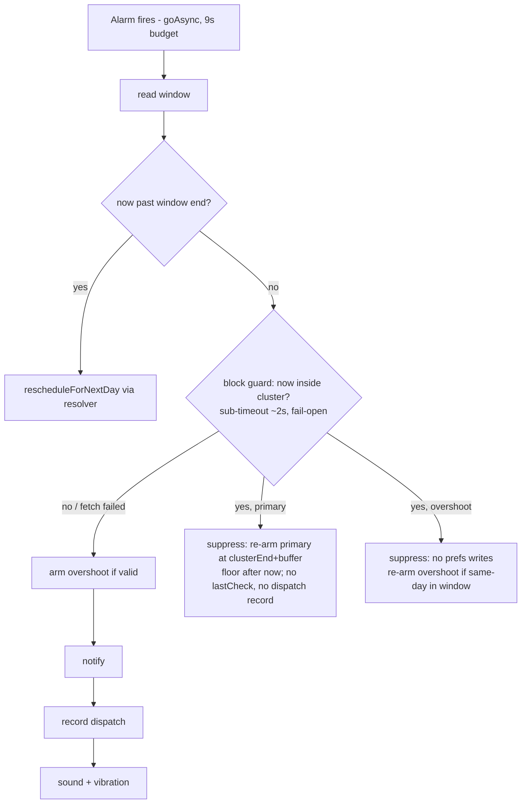

# fix: Window-start alarm ignores calendar blocks covering it

## Summary

Route every path that arms a "first alarm of the day" through a shared window-start resolver that fetches the target day's blocks (manual + calendar) and applies Rule 4 collision semantics — postponing past the covering block instead of ringing inside it — and add a DYNAMIC-only fire-time guard in `AlarmReceiver` so calendar events created or moved after arming are still honored. Regression coverage lands at the pure-function level following the existing scheduler test harness.

---

## Problem Frame

Reported: activity window start was 09:30, a calendar event ran 09:10–09:40, and the alert fired at exactly 09:30. The Rule 4 collision engine in `DynamicSchedulerUseCase.evaluateWithDependencies` already handles this geometry correctly for same-day candidates (09:30 inside 09:10–09:40 → postponed to 09:45). The bug is that **no day-rollover path ever reaches Rule 4**: `scheduleForNextActiveDay` early-returns `ScheduledTomorrow(nextDate.atTime(windowStartTime))` and callers arm it verbatim; `rescheduleForNextDay` in `RotationHelpers`, the snooze rollover in `AlarmViewModel.clampSnoozeToBounds`, and the `BootReceiver` replay all arm bare window start with no block fetch for that day. There is also no fire-time block validation, so events added after arming can never suppress a ring.

This is the same structural family as the documented active-days bypass (`docs/solutions/logic-errors/active-days-alarm-bypass-2026-05-16.md`): a guard that lives in one place while `AlarmManager` has multiple independent writers.

---

## Requirements

- R1. A DYNAMIC-mode first alarm of the day must not fire inside a manual or calendar block. When the window start is covered by a block, the alarm is postponed to the covering block-cluster's end + 5 min buffer (reported case: window 09:30, event 09:10–09:40 → ring 09:45). Anticipation before the window start never occurs.
- R2. Every writer that arms a next-day / first-of-day alarm gets this protection or is explicitly documented exempt: engine `ScheduledTomorrow` results (all three early-return sites), `RotationHelpers.rescheduleForNextDay`, and the snooze rollover.
- R3. Calendar changes after arming are honored at fire time: a DYNAMIC dispatch landing inside a block is suppressed and postponed (defense-in-depth). Any guard failure fails open to ringing — an alarm is never silently lost.
- R4. STRICT mode behavior is unchanged everywhere: it may ring inside blocks by design (AE7 contract from the post-testing batch plan).
- R5. New reschedule paths never corrupt session state: bounded lookahead with graceful fallback (never "no alarm armed"), `setLastCheck` is never written, the chain anchor is zeroed only on genuine cross-day rollover, and `schedule → persist` ordering is preserved.
- R6. Regression tests pin the reported geometry and the edge geometries at the pure-function level.

---

## Scope Boundaries

- No new calendar features (calendar selection UX, ContentObserver-based live refresh) — the pull model stays.
- No reactive refresh of the armed alarm or Home preview when blocks/events are created mid-day: the fire-time guard covers the *ring*; a temporarily stale countdown display is accepted (would require Room flow + ContentObserver plumbing).
- No `CalendarEventRepository` API change to distinguish "no events" from "query failed" — degradation stays fail-open (explicit decision, see Key Technical Decisions).
- `BootReceiver` block-revalidation stays deferred (carried over from the active-days doc): the fire-time guard covers post-boot staleness strictly better, at the moment it matters.
- The 23:59 clamp's 1-minute hole on the first day of overnight events, and the DST/NTP epoch-vs-wall-clock gap, remain accepted known limitations.

### Deferred to Follow-Up Work

- Mid-day Rule 4 ping-pong with adjacent blocks (gap < 5 min buffer) inside `evaluateWithDependencies`: pre-existing engine flaw; the new resolver avoids it via cluster merging, but the mid-day loop keeps current behavior. Separate fix with its own tests.
- `docs/solutions/` learning for calendar-integration timing (flagged as a genuine documentation gap): capture via `/ce-compound` after this fix lands.

---

## Context & Research

### Relevant Code and Patterns

- `app/src/main/java/com/gtg/app/domain/usecase/DynamicSchedulerUseCase.kt` — pure engine (Rules 1–5), `PrefetchedDependencies` (deliberately date-less; callers filter cross-date results externally), single-date `preFetchForDate`, Rule 4 constants (`MINIMUM_REST_MINUTES=20`, `INACTIVITY_PROXIMITY_MINUTES=15`, `INACTIVITY_BUFFER_MINUTES=5`).
- `app/src/main/java/com/gtg/app/domain/usecase/RotationHelpers.kt` — the established home for cross-writer invariants (`findNextActiveDate` 7-day bound + fallback, `isInsideActiveWindow`, `rescheduleForNextDay` with its `canScheduleExactAlarms` precondition and side-effect contract).
- `app/src/main/java/com/gtg/app/presentation/alarm/AlarmReceiver.kt` — goAsync + `withTimeout(9s)` + wakelock pattern; documented effect ordering (overshoot armed before notify; `recordAlarmDispatchedNow` after notify).
- `app/src/main/java/com/gtg/app/data/repository/CalendarEventRepositoryImpl.kt` — live pull from `CalendarContract.Instances`, busy-only, virtual blocks with negative IDs, `getBlocksInRange` batch API, all failures degrade to empty.
- `app/src/main/java/com/gtg/app/presentation/alarm/AlarmViewModel.kt` — `clampSnoozeToBounds` (snooze deliberately bypasses the scheduler; validates active days + window end only).
- Test harness: `app/src/test/java/com/gtg/app/domain/usecase/DynamicSchedulerUseCaseTest.kt` (pure-engine tests, parameter-injected time, fixed `LocalDate` anchors, Portuguese backtick names, `deps(blocks)` helper — note `calendarBlocks` is always empty today), `app/src/test/java/com/gtg/app/presentation/alarm/AlarmViewModelTest.kt` (MainDispatcherRule, MockK, `slot<LocalDateTime>()` capture). JUnit4 + MockK + kotlinx-coroutines-test only; **no Robolectric/instrumentation** — receiver wiring is manually verified by repo convention.

### Institutional Learnings

- `docs/solutions/logic-errors/active-days-alarm-bypass-2026-05-16.md` — writer-enumeration discipline (`grep -rn "AlarmScheduler\." app/src/main/java/`); fix belongs at the schedule site, fire-time guards are defense-in-depth; `schedule()` before `setNextAlarm()` because `AlarmSchedulerImpl` swallows `SecurityException`.
- `docs/solutions/architecture-patterns/alarm-receiver-goasync-coroutine-room-2026-05-22.md` — the receiver suspend-work template (budget hierarchy, cleanup-on-all-paths).
- `docs/solutions/logic-errors/alarm-receiver-overshoot-schedule-race-2026-05-19.md` — overshoot armed before notify; constrains where new suspend I/O may sit in the dispatch order.
- `docs/solutions/architecture-patterns/cadence-anchor-vs-reschedule-anchor-2026-05-19.md` — `setLastCheck` is user-history; reschedule writers may touch `setNextAlarm` only.
- `docs/solutions/documentation-gaps/dst-ntp-clock-jumps-countdown-2026-05-22.md` — stay in the wall-clock `LocalDate`/`LocalTime` domain; do not introduce `ZonedDateTime`/`Instant` into collision logic.

### External References

- None needed — local patterns and documented precedent fully cover this fix.

---

## Key Technical Decisions

- **Shared window-start resolver, new pure function + suspend lookahead wrapper in `DynamicSchedulerUseCase`**: the capability "compute a valid first-alarm time for day X" must live in one place all writers delegate to (direct lesson from the active-days bypass). Not reusing `evaluateWithDependencies` as the entry: it would need a synthetic `checkTime`, and its rest-min/anticipation semantics don't apply at rollover or fire time. The pure core takes (date, window, day's merged blocks, mode) and is directly unit-testable.
- **Cluster merging before collision**: blocks whose gap ≤ the 5-min buffer are merged (interval union) before resolving. Consequence: after one postponement to cluster end + buffer, the candidate cannot land inside another block (any block that close would have merged) — single-pass resolution by construction, no ping-pong, no iteration-exhaustion arming inside a meeting on a packed morning. Merging stays inside the resolver; the mid-day engine loop is untouched to keep blast radius small.
- **Bounded lookahead, graceful exhaustion**: if postponement crosses the window end, roll to the next active day and resolve that day, up to 7 days (mirrors `findNextActiveDate`). On exhaustion, arm bare window start of the last examined active day and log a warning — never end up with no alarm armed; the fire-time guard is the net. (Steady state under a permanent full-day block: one suppressed dispatch per day — deliberate, user declared themselves inactive.)
- **Fire-time guard is postpone-only with a floor strictly after now**: the re-arm target is the covering cluster's end + buffer, floored just after `now`. The anticipate branch is never used at fire time — anticipating can land in the past and produce an immediate-fire suppress loop (battery drain, AlarmManager throttling).
- **Fire-time dispatch order**: window read → out-of-window guard → **block guard** (own short sub-timeout ~2s; failure or timeout fails open to Ring) → overshoot validate+arm → notify → `recordAlarmDispatchedNow` → sound/vibration. Placing the guard before `scheduleOvershoot` is safe: the race the overshoot-before-notify invariant protects against requires a visible notification, which doesn't exist yet. The race-invariant solution doc gets amended with this rationale so a future reader doesn't "restore" the old ordering over the guard.
- **Overshoot firing inside a block**: suppress the ring and write **nothing** to prefs (`setNextAlarm` would flip `isAlarmPending=false` and evaporate the user's pending set; the chain anchor must survive). Re-arm the next overshoot at cluster end + buffer if it's still same-day, inside the window, and the session is active — otherwise the chain stalls exactly as it already does at window end.
- **Primary suppressed at fire time**: re-arm via the resolver's floor semantics; write `setNextAlarm` (scheduling state), never `setLastCheck` (cadence anchor), never `recordAlarmDispatchedNow` (no ring happened); preserve the chain anchor; cancel a stale overshoot defensively; mirror the `canScheduleExactAlarms` precondition from `rescheduleForNextDay`; read pending exercise from `sessionPrefs.pending*`, never intent extras (stale-overshoot precedent).
- **STRICT exempt everywhere**: rollover resolution and fire-time guard are both gated on `IntervalMode.DYNAMIC`. STRICT arms bare window start and rings inside blocks by documented design.
- **Snooze**: same-day snooze stays scheduler-free at arming, but if it lands inside a block the fire-time guard postpones it — a deliberate behavior change consistent with DYNAMIC's "never ring inside a block" philosophy; documented in `performSnooze` KDoc. Snooze *rollover* delegates to the resolver. The no-window midnight fallback inside `clampSnoozeToBounds` is unchanged (the resolver requires a window).
- **Calendar degradation stays fail-open**: integration off / permission revoked / provider failure all read as "no blocks", so the alarm may ring inside an invisible event — accepted, because fail-closed risks alarms that never ring, and it matches the repository contract ("callers don't handle errors"). Documented here so the silence is a decision, not an accident.
- **Half-open semantics frozen**: a block ending exactly at window start (09:00–09:30) does not collide with a 09:30 candidate — rings at 09:30 with zero buffer, consistent with mid-day `candidate == blockEnd` behavior. Pinned with a test either way so it's intentional.
- **Lookahead fetching may batch** via the existing `getBlocksInRange(date, date+7)` instead of per-day queries — directional perf nicety that also shrinks the receiver's time-budget exposure; implementer's choice.

---

## Open Questions

### Resolved During Planning

- Fire-time re-arm semantics → postpone-only with floor strictly after now (prevents immediate-fire loops).
- Overshoot-in-block behavior → suppress, zero prefs writes, conditional overshoot re-arm (prevents both chain-state corruption and meeting-interrupting re-alerts).
- Guard I/O vs the 9s receiver budget → dedicated ~2s sub-timeout, fail-open to Ring; dispatch order pinned; race doc amended.
- Back-to-back blocks ping-pong → cluster merging in the resolver; mid-day engine loop deferred to follow-up.
- Lookahead bound / exhaustion → 7 days, bare-start fallback + warning log.
- Resolver entry → new pure function, not a synthetic-`checkTime` reuse of `evaluateWithDependencies`.
- Block ending exactly at window start → keep half-open (no collision), frozen with a test.
- Snooze stretched by the fire-time guard → accepted under DYNAMic philosophy, documented in KDoc.

### Deferred to Implementation

- Exact names/signatures of the resolver, its suspend wrapper, and the fire-time decision helper (and whether the helper lives in `RotationHelpers.kt` or a sibling file): naming falls out of the code.
- Whether `calculateNextAlarm` post-processes `ScheduledTomorrow` inline or via a small internal method — must keep `PreviewTodayRoutineUseCase`'s direct `evaluateWithDependencies` path semantically untouched.
- Exact sub-timeout value (~2s) and floor offset (~1 min): tune against real provider latency during implementation.
- Whether `RotationHelpersTest.kt` needs a `MainDispatcherRule` once `rescheduleForNextDay` becomes suspend: mechanical, decided at test-writing time.

---

## High-Level Technical Design

> *This illustrates the intended approach and is directional guidance for review, not implementation specification. The implementing agent should treat it as context, not code to reproduce.*

Resolver (pure core; suspend wrapper does fetch + day iteration):

```text
resolveFirstAlarmForDay(date, window, blocksOf(date), mode):
  candidate = date.atTime(window.startTime)
  STRICT → return candidate
  clusters = merge blocks with gap ≤ INACTIVITY_BUFFER_MINUTES
  if candidate inside a cluster → candidate = clusterEnd + buffer   (single pass, by construction)
  if candidate ≥ window end → signal "roll to next active day"      (wrapper iterates, ≤ 7 days)
  return candidate
exhaustion → bare window start of last examined active day + warn log
```

Fire-time dispatch order (DYNAMIC):



---

## Implementation Units

### U1. Pure window-start resolver with cluster merging

**Goal:** One pure, unit-testable function that turns (date, window, that day's blocks, mode) into a valid first-alarm time, plus a suspend wrapper that fetches blocks per candidate date and iterates the bounded next-day lookahead.

**Requirements:** R1, R4, R5, R6

**Dependencies:** None

**Files:**
- Modify: `app/src/main/java/com/gtg/app/domain/usecase/DynamicSchedulerUseCase.kt`
- Test: `app/src/test/java/com/gtg/app/domain/usecase/DynamicSchedulerUseCaseTest.kt`

**Approach:**
- Pure core has no rest-min concept (rollover and fire-time callers don't have a "check moment") and exposes the postpone-only/floor option the fire-time caller needs.
- Cluster merging (gap ≤ buffer) before collision; single-pass postponement; window-end signal makes the wrapper roll to the next active day (reuse `findNextActiveDate`), max 7 days, exhaustion → bare start + `Log.w`.
- Suspend wrapper reuses `preFetchForDate` per day or batches with `getBlocksInRange` — implementer's choice.
- STRICT short-circuits to bare window start.

**Execution note:** Test-first — repo convention for core scheduler algorithm changes.

**Patterns to follow:**
- Rule 4 Caso B semantics and the existing `INACTIVITY_BUFFER_MINUTES` constant (resolved time must equal what same-day Rule 4 would produce for the reported geometry: 09:45).
- `findNextActiveDate`'s 7-day bound with defensive fallback.
- `PrefetchedDependencies` date-less contract — do not add a date field; the wrapper owns date alignment.

**Test scenarios:** (Portuguese backtick names, fixed date anchors, per harness convention)
- Happy path: window 09:30–18:00, calendar block 09:10–09:40 → resolved 09:45 (the reported bug, frozen).
- Happy path: no blocks → 09:30 bare.
- Edge: block starting exactly at window start (09:30–10:00) → 10:05 (no anticipation before the window).
- Edge: block ending exactly at window start (09:00–09:30) → 09:30 (half-open semantics frozen).
- Edge: back-to-back blocks 09:00–10:00 and 10:00–10:30 → merged cluster → 10:35, single pass (no ping-pong).
- Edge: blocks 09:00–10:00 and 10:03–10:30 (gap 3 min ≤ buffer) → merged → 10:35.
- Edge: block covering the entire window → rolls to next active day and applies *that* day's blocks (different fixture per day).
- Edge: full-day block on every lookahead day → exhaustion after 7 days → bare window start of last examined active day (no exception, never "no result").
- Edge: manual block + calendar block both covering window start → merged across sources.
- Edge: postpone-only/floor option — candidate inside a block 5 min past its start still postpones (never anticipates), result strictly after the floor.
- Mode: STRICT with block 09:10–09:40 → 09:30 bare.
- Integration: full existing `DynamicSchedulerUseCaseTest` suite still green — `evaluateWithDependencies` same-day behavior unchanged.

**Verification:** New tests green; existing suite green; no caller behavior changes yet (resolver unused outside tests).

---

### U2. Route every rollover writer through the resolver

**Goal:** All paths that arm a next-day / first-of-day alarm use resolved times instead of bare window start.

**Requirements:** R1, R2, R4, R5

**Dependencies:** U1

**Files:**
- Modify: `app/src/main/java/com/gtg/app/domain/usecase/DynamicSchedulerUseCase.kt` (`calculateNextAlarm` resolves `ScheduledTomorrow` results before returning — covers all three `scheduleForNextActiveDay` early-return sites)
- Modify: `app/src/main/java/com/gtg/app/domain/usecase/RotationHelpers.kt` (`rescheduleForNextDay` becomes suspend and delegates to the resolver for DYNAMIC; keeps `canScheduleExactAlarms` precondition, cancel-both-alarms, `schedule → setNextAlarm` ordering, chain-anchor zeroing)
- Modify: `app/src/main/java/com/gtg/app/presentation/alarm/AlarmViewModel.kt` (snooze rollover inside `clampSnoozeToBounds` delegates; `performSnooze` KDoc documents the fire-time-guard interaction)
- Modify: `app/src/main/java/com/gtg/app/presentation/home/HomeViewModel.kt`, `app/src/main/java/com/gtg/app/presentation/alarm/AlarmReceiver.kt` (mechanical call-site updates for the now-suspend helper; both already run in coroutine contexts)
- Test: `app/src/test/java/com/gtg/app/domain/usecase/DynamicSchedulerUseCaseTest.kt`, `app/src/test/java/com/gtg/app/domain/usecase/RotationHelpersTest.kt`, `app/src/test/java/com/gtg/app/presentation/alarm/AlarmViewModelTest.kt`

**Approach:**
- Side-effect matrix per call site is the contract: `setNextAlarm` yes (any reschedule writer); `setLastCheck` never (cadence anchor); chain anchor zeroed only on genuine cross-day rollover; intent extras never trusted for pending state.
- `IntervalMode` must reach `rescheduleForNextDay` and the snooze rollover (today they don't receive it) so STRICT keeps bare-start behavior.
- `PreviewTodayRoutineUseCase` calls `evaluateWithDependencies` directly and filters cross-date results externally by design — verify it needs no change.
- Mode source for writers that lack it: read from `SessionPreferences` at the call site, consistent with how callers already assemble scheduler inputs.

**Test scenarios:**
- Happy path: check at 17:50 (window ends 18:00) pushes past window end; next day's window start covered by a 09:10–09:40 calendar block → `ScheduledTomorrow(09:45)`.
- Happy path: inactive-weekday roll lands on an active day whose window start is blocked → resolved time, not bare start.
- Edge: `rescheduleForNextDay` with a blocked next window start → schedules the resolved time; chain anchor zeroed; `setLastCheck` never invoked (assert absence); `schedule` called before `setNextAlarm` (verifyOrder).
- Edge: snooze rollover past window end onto a blocked window start → resolved time (slot-capture on `alarmScheduler.schedule`); STRICT snooze rollover stays bare window start.
- Edge: `canScheduleExactAlarms == false` → existing abort semantics unchanged (no schedule, no `setNextAlarm`, anchor cleanup as today).
- Error path: calendar repository degrades to empty (integration off / failure) → bare window start armed — fail-open frozen with a test.
- Integration: `ScheduledTomorrow` may now carry a time later than window start and a date more than one day out (post-lookahead) — verify Home/Alarm UI strings render the value rather than hardcoding "tomorrow at window start" phrasing.

**Verification:** Run the writer-enumeration discipline from the active-days doc (`grep -rn "AlarmScheduler\." app/src/main/java/`) and confirm every writer is either resolver-protected or documented exempt (STRICT paths, `BootReceiver` replay, same-day snooze arming, overshoot arming — the latter three covered at fire time by U3). Full test suite green.

---

### U3. Fire-time block guard in AlarmReceiver (defense-in-depth)

**Goal:** A DYNAMIC dispatch that lands inside a block — typically because the calendar changed after arming — is suppressed and postponed instead of ringing.

**Requirements:** R3, R4, R5

**Dependencies:** U1, U2

**Files:**
- Modify: `app/src/main/java/com/gtg/app/domain/usecase/RotationHelpers.kt` (or a sibling domain helper — pure Ring/Suppress decision function, alongside `isInsideActiveWindow`)
- Modify: `app/src/main/java/com/gtg/app/presentation/alarm/AlarmReceiver.kt` (guard wiring in `handleDispatch`)
- Modify: `docs/solutions/logic-errors/alarm-receiver-overshoot-schedule-race-2026-05-19.md` (amend with the revised ordering rationale)
- Test: `app/src/test/java/com/gtg/app/domain/usecase/RotationHelpersTest.kt` (or the helper's own test file)

**Approach:**
- Pure decision function: (now, mode, dispatch type primary/overshoot, day's merged blocks) → `Ring` or `Suppress(rearmAt)` with `rearmAt` = cluster end + buffer, floored strictly after now. Receiver wiring stays thin.
- Guard sits after the out-of-window guard, wrapped in its own ~2s sub-timeout; any failure or timeout → `Ring` (fail-open — a lost ring is worse than a meeting interruption).
- Primary suppress: cancel stale overshoot, re-arm primary, `setNextAlarm`, `canScheduleExactAlarms` precondition, pending state from `sessionPrefs.pending*`; no `setLastCheck`, no `recordAlarmDispatchedNow`, chain anchor untouched.
- Overshoot suppress: zero prefs writes; re-arm overshoot at `rearmAt` only if same-day, inside window, session active — else stall as the chain already does at window end.
- STRICT → always `Ring`.

**Execution note:** Test-first for the pure decision helper. Receiver wiring has no unit-test infra (no Robolectric, per repo convention) — verified by the manual checklist below.

**Test scenarios:** (pure helper)
- Happy path: DYNAMIC primary at 09:30 with block 09:10–09:40 → `Suppress(09:45)`.
- Happy path: DYNAMIC primary with no covering block → `Ring`.
- Edge: block 09:10–09:31, now 09:30 → `rearmAt` strictly after now (floor honored even when cluster end + buffer is marginal).
- Edge: now is 5 min past block start → still postpone (anticipate branch never used at fire time).
- Edge: back-to-back blocks around now → `rearmAt` at merged cluster end + buffer.
- Edge: overshoot dispatch inside block → suppress variant that distinguishes dispatch type (caller decides re-arm semantics; assert no scheduling-state output for the overshoot case).
- Mode: STRICT inside block → `Ring`.
- Integration (manual on-device checklist): event covering now → alarm is silent (no notification, no sound, no vibration) and Home shows the postponed time; postponed alarm rings at cluster end + buffer; overshoot during a meeting stays silent and resumes after; total dispatch time stays inside the receiver budget with calendar integration on.

**Verification:** Decision-helper tests green; manual checklist passes on device; race-invariant doc amended so the new ordering is documented institutional knowledge.

---

## System-Wide Impact

- **Writer coverage after this plan** (the parity table reviewers should check):

| Writer | Today | After this plan |
|---|---|---|
| Engine `ScheduledTomorrow` (inactive weekday, window-end initial, window-end post-collision) | bare window start | resolver (U2) |
| `RotationHelpers.rescheduleForNextDay` (Home countdown rollover, receiver out-of-window guard) | bare window start | resolver (U2) |
| Snooze rollover (`clampSnoozeToBounds`) | bare window start | resolver (U2) |
| Same-day snooze arming | user-explicit, unvalidated | unchanged at arming; fire-time guard catches block landings (U3) |
| `BootReceiver` replay | persisted millis verbatim | unchanged; fire-time guard covers staleness (U3) |
| Overshoot arming | window-end validated only | unchanged at arming; fire-time guard (U3) |
| All STRICT paths | bare window start | unchanged by design (R4) |

- **Interaction graph:** `HomeViewModel` and `AlarmViewModel` consume `ScheduleResult` verbatim — they need no logic change, but now receive resolved times. `AlarmReceiver.handleDispatch` gains one decision point. `PreviewTodayRoutineUseCase` is untouched (direct `evaluateWithDependencies` consumer with external date filtering).
- **Error propagation:** calendar degradation reads as "no blocks" at both schedule and fire time (fail-open, documented); guard failure/timeout → Ring; lookahead exhaustion → bare start + warning log. No new exceptions cross the receiver boundary (existing catch + `finally` teardown unchanged).
- **State lifecycle risks:** `setNextAlarm` flips `isAlarmPending=false` as a side effect — only genuine reschedules may call it; overshoot suppression writes nothing; `recordAlarmDispatchedNow` only on an actual ring; chain anchor zeroed only on cross-day rollover. These four rules are the corruption surface — U2/U3 tests assert the *absence* of forbidden writes.
- **API surface parity:** `ScheduleResult.ScheduledTomorrow` semantics widen (time may exceed window start; date may be >1 day out) — UI copy that assumes "tomorrow at window start" is checked in U2.
- **Integration coverage:** receiver wiring is manual-verification-only (no instrumentation infra) — mitigated by extracting the decision into a pure tested helper, the same discipline as `isInsideActiveWindow`.
- **Unchanged invariants:** same-day `evaluateWithDependencies` semantics; STRICT contract (AE7); preview's external date filter; cadence-anchor discipline; overshoot-before-notify (re-justified for the new guard position, doc amended); `schedule → persist` ordering; goAsync budget/wakelock structure.

---

## Risks & Dependencies

| Risk | Mitigation |
|------|------------|
| New ContentResolver query in the receiver blows the 9s budget on slow/post-doze devices → silent total alarm loss | Dedicated ~2s sub-timeout failing open to Ring; optional batch fetch; manual on-device timing check (U3) |
| Suppress loop: re-armed alarm fires still inside the same block | Postpone-only + floor strictly after now + cluster merging — pinned by U1/U3 tests |
| Chain-state corruption from suppression paths (`isAlarmPending` flip, anchor zeroing) | Explicit side-effect matrix per call site; tests assert forbidden writes are absent |
| Snooze silently stretched by the guard (user asked 5 min, gets 70) | Deliberate, documented decision (DYNAMIC philosophy); KDoc note in `performSnooze`; revisit only on user feedback |
| Resolver semantics drift from engine Rule 4 over time | Resolver reuses the same constants and Caso B postponement; the reported-geometry test pins both to 09:45 |
| Permanent full-day blocks create a "suppressed dispatch per day" steady state | Accepted deliberately (user-declared inactivity); warning log makes it observable |
| `rescheduleForNextDay` becoming suspend ripples to call sites | Both call sites already run in coroutine contexts (ViewModel scope, goAsync coroutine) — mechanical, covered by U2 tests |

---

## Documentation / Operational Notes

- Amend `docs/solutions/logic-errors/alarm-receiver-overshoot-schedule-race-2026-05-19.md` with the revised dispatch ordering and its rationale (U3).
- Update `performSnooze` KDoc with the fire-time-guard interaction (U2).
- After landing, run `/ce-compound` to capture the calendar-integration-timing learning (currently a documented gap in `docs/solutions/`).

---

## Sources & References

- Related code: `app/src/main/java/com/gtg/app/domain/usecase/DynamicSchedulerUseCase.kt`, `app/src/main/java/com/gtg/app/domain/usecase/RotationHelpers.kt`, `app/src/main/java/com/gtg/app/presentation/alarm/AlarmReceiver.kt`, `app/src/main/java/com/gtg/app/presentation/alarm/AlarmViewModel.kt`, `app/src/main/java/com/gtg/app/data/repository/CalendarEventRepositoryImpl.kt`
- Institutional learnings: the five `docs/solutions/` entries listed in Context & Research
- Prior plans: `docs/plans/2026-05-20-001-feat-post-testing-batch-plan.md` (Rule order + AE7 STRICT contract), `docs/plans/2026-05-21-001-feat-alarm-snooze-rotation-followups-plan.md` (RotationHelpers, snooze bounds, no-Robolectric convention), `docs/plans/2026-05-16-001-refactor-runtime-performance-optimization-plan.md` (prefetch cache, preview consistency)
